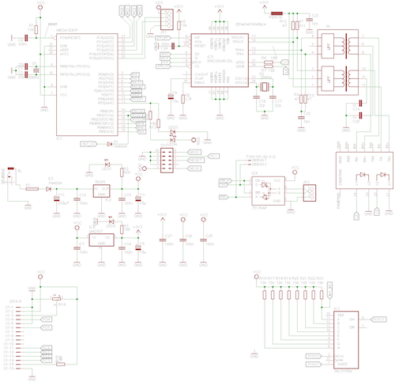

dirarare-artnet-server
======================

A ArtNet to DMX node

## Hardware ##
### Schematics ###

### Partlist ###

| Part             |          Value |
|:-----------------|---------------:|
| C1               | 22p            |  
| C2               | 22p            |
| C3               | 10µ            |
| C4               | 100n           |
| C5               | 10µ            |
| C6               | 10µ            |
| C7               | 100n           |
| C11              | 220µF          |
| C14              | 100n           |
| C15              | 100n           |
| C16              | 100n           |
| C17              | 22p            |
| C18              | 22p            |
| C19              | 1n             |
| C20              | 1n             |     
| C22              | 10n            |     
| C23              | 10n            |      
| C24              | 100n           |       
| C25              | 100n           |       
| C26              | 100n           |       
| C27              | 100n           |       
| D1               | 1N4004         |         
| D3               | 1N4004         |       
| DEBUG            | TSW-101-02-S-Q |
| F1               |                |    
| FERITE           |                |           
| IC1              | MEGA328-P      |
| IC2              | 78S05          |
| IC3              | 74LS165N       |  
| IC4              | 75176AP        |
| IC5              | ENC28J60-DIL   |   
| IC6              | LM2937         |
| J1               | DCJ0202        |
| JP1              |                |
| JP2              |                |
| LED1             |                |
| LED2             |                |
| LED3             |                |
| LED4             |                | 
| Q1               | 20Mhz          |   
| Q2               | 25Mhz          | 
| R1               | 10k            |
| R2               | 820            |
| R3               | 180            |
| R4               | 180            |
| R5               | 10k            |
| R6               | 180            |
| R7               | 180            |
| R8               | 2,7k           |
| R9               | 47             |
| R10              | 47             |
| R11              | 47             |
| R12              | 47             |
| R13              | 180            |
| R14              |                |
| R15              | 180            | 
| R16              | 10k            |
| R17              | 10k            |
| R18              | 10k            |
| R19              | 10k            |
| R20              | 10k            |
| R21              | 10k            |
| R22              | 10k            |
| R23              | 10k            |
| SV1              |                |
| TR               |                |
| U$1              |                |
| X1               | 2516-5         | 

## Software ##

t.b.d. take a look in the code